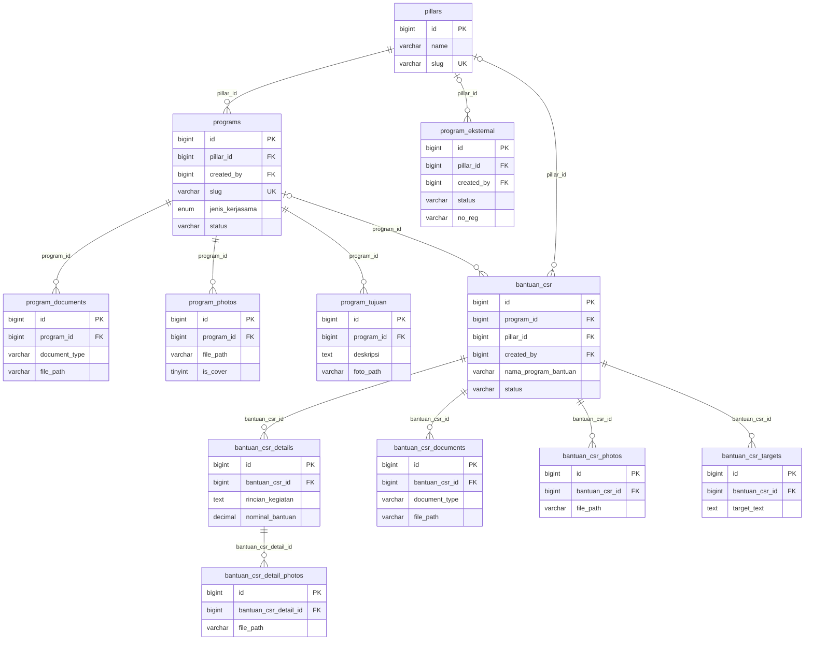
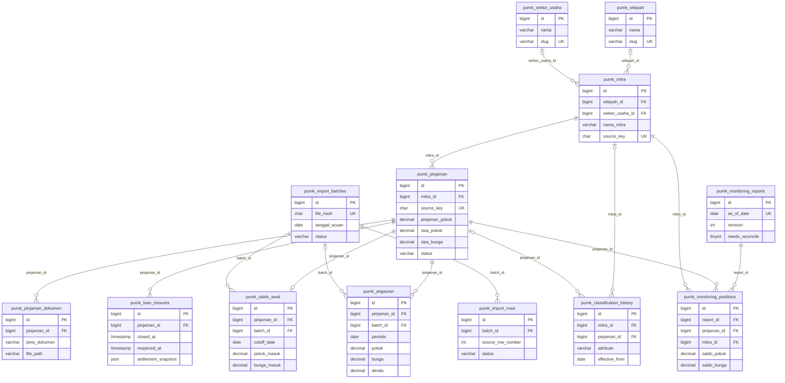
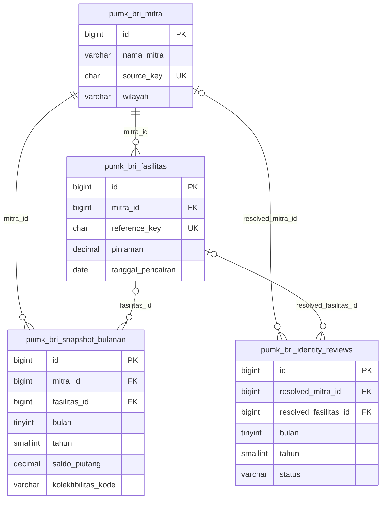

# ERD TJSLINKA (skema aplikasi lokal)

ERD ini disusun dari **53 tabel dan 61 foreign key yang benar-benar ada** pada skema MySQL yang sedang dipakai aplikasi lokal, diperiksa pada 5 Oktober 2026. Seluruh 54 migrasi terdaftar berstatus `Ran`. Pemeriksaan hanya membaca metadata skema; tidak mengubah data.

Diagram dipisah per modul agar dapat dibaca. Kolom dalam kotak adalah **kolom kunci dan contoh atribut penting**, bukan daftar seluruh kolom. Garis utuh hanya menyatakan foreign key fisik di database. `o|` di sisi tabel induk berarti foreign key pada anak boleh `NULL`; `||` berarti wajib. `o{` berarti satu induk dapat mempunyai nol atau banyak baris anak. Relasi aktor ke `users` dirinci terpisah setelah diagram supaya garis tidak menutupi relasi bisnis.

## 1. Program TJSL dan Bantuan TJSL

`bantuan_csr` adalah tabel tersendiri. `program_id` di dalamnya memang foreign key opsional ke `programs`, bukan tanda bahwa semua bantuan harus berasal dari program internal. `program_eksternal` hanya ber-FK ke `pillars` dan `users`; kolom teksnya seperti `tpb` dan `program` bukan FK ke tabel dashboard atau `programs`.

## 2. PUMK internal — mitra, kartu piutang, pelunasan, dan monitoring

Kartu piutang berpusat pada `pumk_pinjaman`, dengan saldo awal, angsuran, dokumen, serta histori penutupan sebagai tabel berbeda. `pumk_saldo_awal.pinjaman_id` unik (maksimal satu saldo awal per pinjaman). `pumk_angsuran` unik pada `(pinjaman_id, periode)`; dokumen unik pada `(pinjaman_id, jenis_dokumen)`. **`pumk_loan_closures.pinjaman_id` tidak unik**, sehingga ERD tidak menyatakan satu pinjaman hanya bisa mempunyai satu catatan penutupan. Posisi monitoring unik pada `(report_id, pinjaman_id)`.

`pumk_snapshot_bulanan` tidak muncul sebagai anak `pumk_pinjaman` karena kolom bisnis tabel agregat itu adalah `(bulan, tahun, kategori, tipe, nilai)` dan **tidak mempunyai FK**. `pumk_activity_logs` juga tidak mempunyai FK langsung ke mitra/pinjaman: `entity_type` dan `entity_id` adalah rujukan generik, bukan constraint database.

## 3. PUMK BRI — sumber terpisah dari kartu piutang internal

`pumk_bri_snapshot_bulanan.mitra_id` wajib, tetapi `fasilitas_id` boleh kosong untuk snapshot legacy. Saat terisi, kombinasi `(fasilitas_id, bulan, tahun)` unik. FK yang ada **tidak menjamin** bahwa `mitra_id` snapshot selalu sama dengan pemilik `fasilitas_id`; kesesuaian itu harus dijaga oleh logika aplikasi atau pemeriksaan data. Review identitas hanya menunjuk Mitra/Fasilitas setelah `resolved_*` diisi.

Tidak ada FK dari tabel `pumk_bri_*` ke `pumk_mitra` atau `pumk_pinjaman`. Dua dataset ini tidak boleh digabung dalam ERD seolah satu sumber pinjaman.

## 4. ERD gabungan tiga bagian

Tiga ERD di atas tetap tersedia untuk membaca detail setiap modul. Gambar berikut menyatukan tabel dan relasi utamanya dalam **satu kanvas**. `users` menghubungkan Program TJSL dengan PUMK internal melalui FK aktor yang dipilih. PUMK BRI tetap menjadi kelompok tersendiri di kanvas yang sama karena tidak ada FK dari snapshot/fasilitas BRI ke tabel PUMK internal atau Program TJSL; garis penghubung antardataset tidak dibuat-buat.

[Buka gambar SVG ukuran penuh](output/erd/ERD-TJSLINKA-gabungan.svg) · [Sumber diagram Mermaid](output/erd/ERD-TJSLINKA-gabungan.mmd)

## 5. Tabel agregat, referensi, dan infrastruktur tanpa FK antartabel bisnis

| Kelompok | Tabel yang benar-benar ada | Kunci atau fungsi yang terlihat dari skema |
|---|---|---|
| Agregat PUMK BRI | `pumk_bri_ringkasan`, `pumk_bri_rka_tahunan`, `pumk_bri_penyaluran_bulanan`, `pumk_bri_saldo_bulanan`, `pumk_bri_sektor`, `pumk_bri_kualitas` | Unik menurut `tahun`, `(tahun, bulan)`, kategori-periode, atau nama/kategori masing-masing; **tidak saling ber-FK** dan tidak ber-FK ke snapshot. |
| Agregat PUMK internal | `pumk_snapshot_bulanan` | Unik pada `(bulan, tahun, kategori, tipe)`; tidak ber-FK ke pinjaman. |
| Dashboard/referensi TJSL | `bidang_prioritas`, `tpb_dashboard`, `wilayah_operasional` | Berdiri sendiri; `nama_bidang` dan `nomor_tpb` unik. |
| Infrastruktur Laravel | `cache`, `cache_locks`, `failed_jobs`, `job_batches`, `jobs`, `migrations`, `password_reset_tokens`, `sessions` | Ada dalam database, tetapi tidak memiliki constraint FK ke tabel bisnis. `sessions.user_id` dan `password_reset_tokens.email` bukan FK fisik. |

Periode/tahun yang sama di dua tabel agregat bukan otomatis relasi entitas. Diagram tidak menggambar garis untuk kemiripan nama kolom atau hasil join di kode jika constraint FK tidak ada.

## 6. Relasi pengguna dan audit yang tidak ditarik di diagram utama

Semua kolom di bawah ini **FK fisik ke `users.id`**. Kolom `created_by` pada `programs`, `bantuan_csr`, `program_eksternal`, `teras_produk`, `teras_paket` dan `changed_by` pada `status_logs` wajib terisi; FK pengguna lainnya pada daftar ini boleh `NULL`, kecuali `notifications.user_id` yang juga wajib.

| Tabel | Kolom FK ke `users.id` |
|---|---|
| `programs` | `created_by`, `reviewed_by`, `fase1_reviewed_by`, `fase2_reviewed_by` |
| `bantuan_csr` | `created_by`, `reviewed_by`, `fase1_reviewed_by`, `fase2_reviewed_by` |
| `program_eksternal` | `created_by`, `tahap2_reviewed_by`, `tahap3_reviewed_by` |
| `notifications` | `user_id` |
| `status_logs` | `changed_by` |
| `teras_produk`, `teras_paket` | `created_by` |
| `pumk_mitra` | `created_by` |
| `pumk_pinjaman` | `created_by`, `lunas_by` |
| `pumk_pinjaman_dokumen` | `uploaded_by` |
| `pumk_angsuran` | `created_by` |
| `pumk_import_batches` | `imported_by` |
| `pumk_classification_history` | `recorded_by` |
| `pumk_loan_closures` | `closed_by`, `reopened_by` |
| `pumk_activity_logs` | `actor_user_id` |
| `pumk_bri_rka_tahunan`, `pumk_bri_penyaluran_bulanan` | `created_by`, `updated_by` |

`status_logs.related_type` + `related_id`, `notifications.related_type` + `related_id`, serta `pumk_activity_logs.entity_type` + `entity_id` adalah rujukan bertipe generik. Ketiganya **bukan FK fisik** ke tabel program, bantuan, atau PUMK. Tabel `users` menyimpan role akun dalam satu tabel; tidak ada tabel role terpisah pada skema ini.

## 7. Cara membaca dan memverifikasi ulang

- `PK` = primary key, `FK` = foreign key, `UK` = unique key/indeks unik. Untuk kunci gabungan, rinciannya disebut dalam catatan, bukan ditandai `UK` pada tiap kolom secara terpisah.
- Diagram ini menggambarkan **skema saat diperiksa**, bukan klaim tentang seluruh aturan bisnis di kode atau isi tiap record. Ada tabel tanpa FK yang tetap dipakai aplikasi.
- Sumber pembanding dalam repo: `database/migrations/` dan model di `app/Models/`. Untuk pemeriksaan ulang terhadap database aktif, gunakan metadata `information_schema.COLUMNS`, `KEY_COLUMN_USAGE`, dan `STATISTICS` pada koneksi Laravel lokal; jangan menyimpulkan relasi hanya dari nama kolom.
